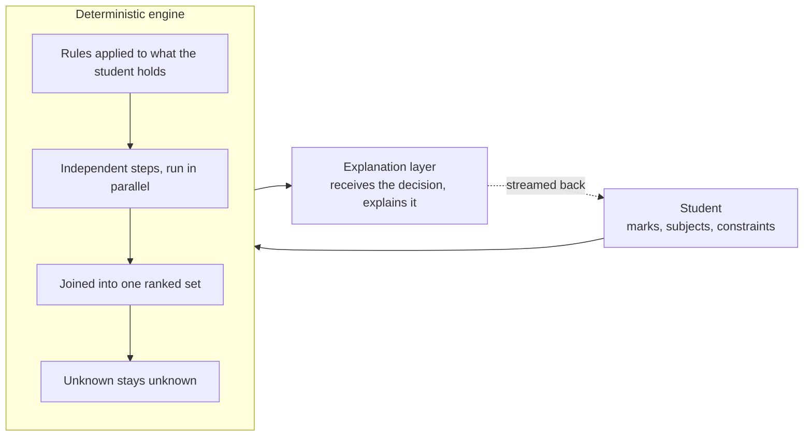
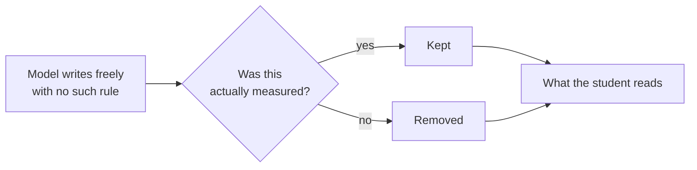

# Rahzaan

**An AI-assisted academic career-guidance system for Karachi secondary-school students.**

*rah* (path) + *zaan* (one who knows).

[Try the live app](https://fyp-career-guidance.vercel.app/) · Architecture and backend by Muhammad Waqas Sharif · Built with a three-person team

---

## Highlights

- **First-response latency cut from 20-25 seconds to 3.7 seconds** by re-architecting a sequential pipeline into parallel fan-out and fan-in stages.
- **A 26-step reasoning graph that cannot deadlock**, because every step runs on every turn and there are no conditional edges.
- **Honesty enforced in code after generation**, not requested in the prompt, which was tried and failed three times.
- **Deployed and validated live**: 60 conversation turns against production with every step traced, and 592 automated tests with none failing.

## The problem

A student in Karachi choosing a university degree is making one of the most consequential and least reversible decisions of their life, usually without access to professional counselling. The wrong choice costs years and a family's savings.

The hard part is not recommendation. It is reasoning truthfully about **eligibility** across a heterogeneous real-world admissions landscape: multiple examination boards, equivalence rules for international qualifications, five academic streams, professional gating from three separate regulatory councils, and merit mechanics that differ per university and are frequently not published at all.

Two requirements pull against each other throughout:

- **Fairness across streams versus data availability.** The data is richest for the students who already have the most options.
- **Being helpful versus being honest.** Showing a student more possibilities is helpful right up until one of them is a degree they are legally barred from entering.

Every significant design decision in this system is a resolution of one of those two tensions.

## What it does

A student enters their marks, stream, and subjects, completes an interest and capability assessment, and states practical constraints such as budget and travel. The system returns a ranked roadmap of degrees they can genuinely enter, each with an honest standing, and a counsellor-style conversation that explains the reasoning and answers follow-up questions.

## The governing principle

**The decisions are made by a deterministic reasoning system working from real admission rules. Language is used only to explain those decisions, never to make them.**

Eligibility, competitiveness, and ranking are computed in plain code with no model in the loop. The language model receives what was decided and explains it. This is what makes the system checkable: a wrong recommendation is a bug with a line number, not a prompt that behaved differently on Tuesday.

It also bounds the blast radius of the least trustworthy component. The most-validated signals drive the ranking. The softer, less-validated signals shape how the result is worded and cannot override it. The worst case for the weakest input is slightly awkward phrasing, not a wrong degree.

---

## Five decisions, and the failures that produced them

Each of these replaced something that was already working and already wrong.

**1. Gate cross-stream eligibility on the foundational subject the student actually holds.**
The earlier approach inferred eligibility from assessed capability. It could present a student a professionally gated medical degree as reachable when no regulator would ever admit them. Capability is not a substitute for a subject you never took. The rules were derived from convergent reading of the governing regulations, not assumed.

**2. Treat an unpublished cutoff as a distinct state, not a missing number.**
Many universities do not publish merit cutoffs. Those degrees were silently defaulting into a middle competitiveness band, which meant the system was manufacturing an assessment and presenting it to a student as a judgement. They now carry an explicit state that says the competitiveness cannot be determined from public data and points the student at the admissions office. Cutoffs are derived from official merit lists or left empty. They are never invented.

**3. Assess students on the curriculum they actually studied.**
The capability assessment was keyed to science subjects. Commerce and humanities students were being measured on material they had never been taught, and their merit was being proxied from it. Assessment is now driven by the intersection of what a student studied and what their reachable degrees actually test.

**4. Never apply a rule retroactively.**
Pass thresholds have changed over time. A student who passed under an older rule is never re-judged against a newer one. This is a small thing that would have harmed a small number of real people and that nobody would have noticed.

**5. Show reach options deliberately.**
The ranked set includes both realistic fits and a guaranteed minimum of aspirational targets that are above the student's current standing but genuinely eligible. A truncated list of safe options is its own kind of dishonesty.

---

## How it is built

The reasoning engine is a directed graph of independent steps rather than a chain of prompts. Steps that do not depend on each other execute concurrently.

The model sits downstream of every decision. There is no path by which it can change a ranking.

| | |
|---|---|
| **26** reasoning steps | 24 inside the graph, 2 running after the response has streamed |
| **52** fields | in the typed state object threaded through every step |
| **22** API endpoints | over 6 database tables |
| **29** routes | in the app, across a single Android and web codebase |
| **7** psychometric instruments | 265 items presented per session |
| **1,409** items | in the assessment banks the session draws from |
| **14,595** job titles | mapped to canonical fields by the labour-market pipeline |
| **592** automated tests | zero failing |

**Parallel fan-out and fan-in.** The pipeline was originally sequential and took 20 to 25 seconds before a student saw anything. Independent work was separated so it could run concurrently, and several steps were split into finer sub-steps so less sat on the critical path. First response now arrives in 3.7 seconds, with the rest streaming in behind it.

**It cannot deadlock, by construction.** Every step runs on every turn and there are no conditional edges. An activation pass makes irrelevant steps no-op rather than removing them from the graph, so every join is always satisfied. A stalled turn caused by an unmet dependency is not a bug that was fixed. It is a state the graph cannot enter.

**One typed state object, threaded end to end.** Every step reads and writes a single typed structure rather than passing loose dictionaries. No step can invent a field another expects, and a shape change surfaces at the boundary instead of three steps downstream as a silent default.

**Streaming that survives the infrastructure.** Responses stream incrementally. Under live conditions on the deployed service a turn held 106.3 seconds past a 30-second proxy timeout without dropping the connection, verified against production rather than a local run.

**Adding a university requires no code.** Eligibility logic is written against a schema, not against institutions, so a new university inherits every gate and filter the moment its data conforms. The tradeoff is recorded honestly: because the logic is schema-dependent, a missing field silently widens eligibility rather than failing loudly. That is a known hazard, not a solved one.

**Changes must leave existing output byte-identical.** Any change not intended to alter what students see is verified to produce identical output for existing profiles. Improvements are additive by default and a restructure has to be argued for.

**Bilingual by design, not by translation.** All seven instruments and the full 265-item session exist in both English and Roman Urdu, the register students actually write in, and the conversation follows whichever the student uses including mixed script mid-sentence. This was built in from the start rather than added as a translation layer, because a psychometric item that reads awkwardly measures something other than what it was validated to measure.

**The project report is compiled, not written.** The full report is generated by a program: seventeen chapter modules, a diagram generator, a shared formatting layer, and an audit pass, compiled into a single document. Figures and the text referencing them cannot drift apart, and the whole thing is reproducible from source rather than being a file three people take turns editing.

**A five-stage labour-market pipeline.** Collection, daily refresh, classification, aggregation, and orchestration, each a separate stage with atomic writes and resumable progress. The source would not expose one needed attribute directly, so the collector recovers it through multiple filtered passes cross-referenced by record id. 14,595 titles were mapped to canonical fields and aggregated across 51 of them, with the records skipped and the fields that received nothing both recorded rather than quietly dropped.

**The model is a swappable component.** Prompts are written so anything working on the weakest supported model works unchanged on a stronger one, which is what made it possible to develop against one provider and deploy on another.

### Enforcing honesty after generation

Instructing the model not to assert unmeasured things failed three times under live conditions. The rule is now enforced in code, after the model has spoken.

Enforcement moved out of the prompt and into code that runs after the model has written. How that guard was proved to be the component actually doing the work is below.

## How correctness is defended

This is the part of the project I would want a reviewer to look at.

**A check that cannot fail is worse than no check.** A guard that never fires is indistinguishable from a guard that does not exist, and worse, because you now trust something that is not working. So guards are tested against the case designed to defeat them. One deterministic gate, which strips claims the system has no measurement to support, was validated by feeding it a plausible, carefully hedged sentence that every other quality check passed. It was stripped when unsupported and preserved when supported. That is a controlled experiment proving which component is doing the work.

**Documentation is generated from source and refuses to guess.** The internal architecture reference is built by reading the running system rather than by transcription. Where the source records nothing, it prints a refusal rather than a plausible sentence. It also displays its own age, because an earlier version once presented a confidently current picture while sitting 151 commits behind. The fix was structural: a check that only runs at build time cannot fire once the artifact exists.

**Confirm the model can make a distinction before designing on it.** A planned feature depended on output varying with how firmly an instruction was phrased. A controlled probe held everything else constant and tested a light and a firm version of the same instruction. The firm one produced less of what was wanted, inverting the intended gradient, so the feature was dropped before it was built. A gradient the model cannot produce is theatre.

**Separate by decomposition, not by instruction.** A single call cannot be told to use some context for one purpose but not another. So the call that decides never receives the material at all, and a second call applies it to the already-decided output. That turns a property you have to test for into one the structure guarantees, because the deciding call's input is identical to a known-good baseline.

**Every non-trivial algorithm carries a written specification.** Not a comment, a specification: purpose, fully typed inputs and outputs, formal step-numbered pseudocode rather than a paste of the implementation, complexity, all three classes of invariant, enumerated edge cases, and the alternatives that were rejected with the reason. The standard states that silently dropped inputs are the most dangerous defect and must appear in the edge cases. It also fixes when to write: after the component is complete and committed, never during, because a document written mid-implementation records the design you started with and then misleads with authority. And it declares itself non-authoritative, ranking committed code above itself.

**Corrections are additive.** Stale text is never deleted or quietly reworded. The correction is filed alongside it. The record therefore contains cases where a correction was itself wrong and had to be corrected back, which is the point.

**Evidence is graded by how close it is to the actual population.** Sources supporting the assessment design are rated on a seven-point proximity scale, from studies on Pakistani students of the same age down to general Western literature, and every step away from the target population is stated openly rather than absorbed. That scale surfaced an uncomfortable result, which appears below.

**Passing tests are treated as claims, not as proof.** A green suite means the code does what the tests assert, not that it is correct, and a test written by the same mind that wrote the code inherits that mind's assumptions. The clearest instance is dated in the log below: five real defects at a system boundary, none of them caught by a suite that was entirely green.

**The instrumentation was audited too, and it was lying.** A live probe found a class of gates that ran on every turn regardless of their condition, then wrote false fired-and-skipped records that were persisted. Reading the code would not have found it, because the code looked correct. Only running it and comparing the record against reality did.

**Investigation is separated from change.** The system was examined across four sequential passes that ran live and mutated no code, so findings could not be quietly absorbed into fixes. One pass rejected one of its own three hypotheses on the evidence. A later pass reversed an earlier pass's conclusion outright, and the reversal is dated in the log below rather than written over the original.

---

## Engineering log

Severity in this project is measured in wrong guidance to a student, not in code quality. Selected record, newest first. Dates are real. Nothing here is reconstructed.

### Open

- **The system does not know whether its advice is good.** No holistic review of counselling quality and no outcome data. Building it needs labelled outcomes that do not exist yet.
- **Two thirds of completed work is believed rather than verified.** Finished items are tagged either live-exercised or reasoned-from-code. Of 55 completed items, 18 have been exercised live. The tagging exists so that suspicion stays pointed at the right 37.
- **The conversation can borrow a student's biography.** When a student volunteers rich personal history, the reply can retell it as the system's own experience. Four instances, all inside the one case that volunteered detail. The existing guard misses it because it checks claims about the student, and this is a false claim about the speaker.
- **A save can fail while the screen says it succeeded.** Result cards are sent before the record is written. If the write fails, the student sees results, the error is swallowed, and the dashboard is empty next launch.
- **Labour-market signal is collected but not connected.** The pipeline runs and produces a per-field demand history. Nothing in the ranking reads it yet.

### Resolved

**2026-07-25 · A fix introduced a defect, and the next gate caught it.** A change made three days earlier produced wrong guidance for one group of students. Fixed in the same pass that found it. The neighbouring finding was pre-existing and was deliberately recorded and left rather than bundled in.

**2026-07-24 · A third of commerce students would have seen the same question twice.** Roughly 32% would have been asked a duplicate. Deduplication makes the student-facing behaviour safe, and the log states plainly that the underlying bank is still wrong and needs a decision, so the fix cannot be mistaken for a resolution.

**2026-07-22 · Stored admission data disagreed with the prospectus.** Re-verification found a legal minimum stored as 50% where the source says 60%, an incomplete list of mandatory subjects, and fees entered as estimates. Corrected against the primary source. What could not be verified was recorded as a finding, including three documents with no extractable text.

**2026-07-17 · A previous fix was proven harmful and reverted.** A change made the day before was traced through its consumers and shown to cause silent scoring corruption on submit. Reverted with evidence, the useful half kept, and an honest non-blocking warning shipped instead of the broken guarantee.

**2026-07-16 · A cited study did not exist.** A scripted answer leaned on a large 2024 study that could not be found; it traced to a single non-peer-reviewed 2023 analysis. The wrong script remains in the file, struck through and marked unusable, with a peer-reviewed replacement beneath it. Three further citation defects were found in the same pass, including a source cited for adolescents whose sample was adults.

**2026-06-30 · An investigation reversed its own earlier finding.** An earlier pass concluded the reasoning over-asserted on thin data. A later pass found the opposite: the thinnest case is the most honest, because the component declines outright, and over-assertion is triggered by conflicting data. Filed alongside the original rather than over it.

**2026-06-28 · The system's own record of what ran was false.** A live probe found a class of gates executing on every turn regardless of condition, then writing and persisting false ran-or-skipped entries. Reading the code would not have found it. The same pass found a measured signal that never reached the explanation layer, so under conflicting data the narrative could assert an identity the measurement contradicted.

**2026-06-16 · 209 passing tests missed five real defects.** An audit of the seam between app and service found a naming mismatch that both deflated merit and triggered a wrong regulatory exclusion, and a scale mismatch that had left counselling branches dead for every live student. Every fixture seeded the canonical values the code expected and never the payload the live app sends, so the tests could not fail and proved nothing about the seam.

**2026-05-15 · The job-market collector was silently discarding 42% of results.** It assumed 25 results per page; the source returns nine or ten, so it skipped every position past the first ten of each page. No error, no warning, a perfectly plausible dataset. Correcting the page stride raised a full pull from 631 records to 1097.

**2026-04-28 · An automated pass had invented merit figures.** A prior data session wrote merit history values matching no published source. Replaced with authoritative figures, with the correction recorded against the session that introduced it.

**2026-04-24 · Every degree was scoring identically.** A pre-demo gate check found a knowledge file empty, collapsing the match component of every score to the same constant. Recorded as amber with a named prerequisite, not as a pass.

## Evidence

Stated at the strength it can actually be defended, as of July 2026.

- **Deployed and validated end to end.** 60 live conversation turns against the production deployment, with every reasoning step traced and the full response stream of every turn captured as an artifact. Every step of the graph was confirmed to have executed in production rather than only in test.
- **592 automated tests, zero failures.** Every correctness fix ships with a regression test that pins it.
- **Evaluated across five representative personas over 50 turns.** These are personas modelling the distribution of Karachi students, evaluated in realistic multi-turn sessions. They are not recruited human participants. A study with real students is in progress and will supersede this. The reason it is five and not more is recorded: at a measured 10.6 model calls per turn against a daily quota, roughly 42 turns per day were possible, so depth was chosen over breadth deliberately.
- **8 universities fully curated of a target 20, spanning 252 degree programmes.** Public and private, general and specialist, chosen to close single-provider gaps rather than to maximise the count.
- **Assessment design grounded in 27 peer-reviewed sources**, including cross-cultural validation studies and Pakistan-specific research on family influence in career decisions.

## Known limitations

- **The interest model's structure has been tested on Pakistani students twice, and both studies found it does not hold.** Two independent structural studies, roughly a thousand students between them, found the circular ordering of the underlying interest model does not fit this population. The instrument's psychometrics were sound and interest-to-aspiration correspondence held for several careers, but the geometry did not. The weighting was deliberately not changed in response, because the limitation is an absence of local structural validation rather than a weak signal, and down-weighting the best-validated input in favour of less-validated ones would make the system less defensible, not more. It is disclosed instead, and the robustness comes from architecture: no recommendation rests on that geometry alone.
- **The instruments are construct-grounded, not instrument-validated.** They use original items built on established frameworks. First-party reliability on a Karachi sample has not been established and will be computed as data accrues. Support is not uniform across them, and the weakest is named as such.
- **Prestige and regional demand are encoded from market knowledge, not surveyed.** The system models how families in Karachi actually weigh degree status, because a recommendation that ignores it will be rejected regardless of fit. Those values were assigned from general market knowledge and have not been validated by a survey.

Everything currently known to be wrong or unfinished is in the engineering log above, under Open.

## Why there is no code here

The source, the curated admission data, and the derived eligibility rules are private. The curation is the work: months of convergent research reconciling regulations, prospectuses, and published merit lists into something a system can reason over correctly.

Everything above is the reasoning, not the mechanism. I am glad to walk through the architecture in a conversation.

---

## Built with

Python and FastAPI, LangGraph for orchestration, PostgreSQL, Flutter for a single Android and web codebase, and Claude models for the conversational layer. No vector search and no machine-learned ranking: there is no dataset of Pakistani student outcomes to train on, and a black-box recommendation a student cannot challenge would defeat the purpose.

## Team

Muhammad Waqas Sharif, primary author and lead developer: architecture, backend, the reasoning and eligibility engine, and the data pipeline. With Muhammad Khuzaim Sajjad (design) and Fazal ur Rehman Khan (data).

---

© 2026 Muhammad Waqas Sharif. All rights reserved. No licence is granted for any use of this work.
